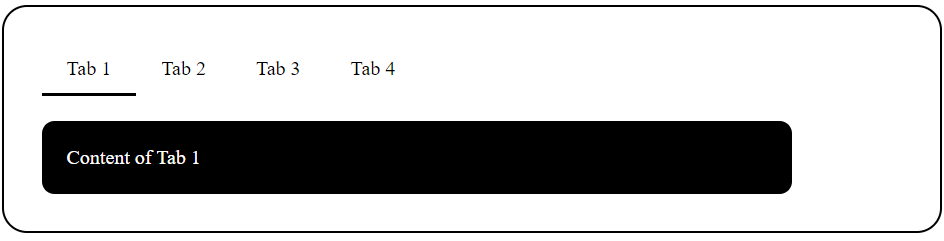

Simple-Tabs

Web Link 

https://abh7n.github.io/simple-tabs/

A lightweight, accessible, and customizable tabbed interface.

Features

- Easy to implement and customize
- Supports multiple tabs
- Accessible and responsive design
- Lightweight and efficient

Installation

Using npm

bash
npm install simple-tabs

Using CDN

<link rel="stylesheet" href="(link unavailable)">

Usage

HTML

  

    <button class="tab-button active" data-tab="tab1">Tab 1</button>
    <button class="tab-button" data-tab="tab2">Tab 2</button>
    <button class="tab-button" data-tab="tab3">Tab 3</button>
  

  

    
Tab 1 Content

    
Tab 2 Content

    
Tab 3 Content

  

JavaScript

const simpleTabs = new SimpleTabs({
  container: '.simple-tabs',
  tabs: ['.tab-button'],
  panes: ['.tab-pane']
});

Options

- container: Selector for the tab container element
- tabs: Array of selectors for tab button elements
- panes: Array of selectors for tab content elements

Methods

- init(): Initializes the tab interface
- destroy(): Destroys the tab interface

Events

- tabChange: Fired when a tab is changed

Browser Support

- Chrome
- Firefox
- Safari
- Edge

License

(link unavailable)

Contributing

Contributions are welcome! Please submit a pull request.

Authors

- (link unavailable)

Version

1.0.0

Replace the placeholder links, images, and information with your actual project details.
